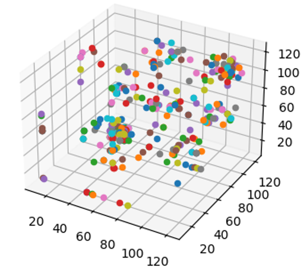
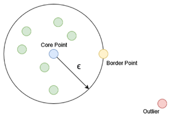

DATE
=======

DATE is a Density Analysis-based Tensor Encoder which uses density-based spatial
clustering of applications with noise (DBSCAN) to analyze point clouds generated
from packet payloads. An application of the `Manifold Hypothesis
<https://deepai.org/machine-learning-glossary-and-terms/manifold-hypothesis>`_
which states that real world, high-dimensional data lie on low-dimensional manifolds
embedded within a high-dimensional space, DATE leverages the natural shape of
data formed when represented as a point cloud in three-dimensional space and
uses statistical features in order to determine similarities and classify accordingly.

Feature Generation into Point Clouds
~~~~~~~~~~~~~~~~~~~~~~~~~~~~~~~~~~~~~

The packet payloads are first converted from raw bytes in hexadecimal to
a decimal value. Using a sliding window technique, three-dimensional coordinates
are cut from the payload.

.. code-block::

    89, 45, 23, 7, 14, 67, 90, ...
    |   |   |
    x   y   z

    89, 45, 23, 7, 14, 67, 90, ...
        |   |   |
        x   y   z

    89, 45, 23, 7, 14, 67, 90, ...
            |   |   |
            x   y   z

    coordinates = [(89, 45, 23), (45, 23, 7), (23, 7, 14)]

Each of these coordinates are plotted onto a three-dimensional (255x255x255)
plane which generates a static point cloud. Similar packets should produce
similar point clouds.

  Example point cloud generated from a SIP packet.

Density-based Cluster Analysis (DBSCAN)
~~~~~~~~~~~~~~~~~~~~~~~~~~~~~~~~~~~~~~~

Density-Based Spatial Clustering of Applications with Noise (DBSCAN)
uses three different point classifications: Core points represent centers of
clusters and points are labeled as such based on the number of neighbors
they have compared to their neighbors. Border points represent the edges
and possess the least number of neighbors but are still within the range of a
core point. Noise or Outlier points are neither borders nor cores and do not
belong to a cluster. The DBSCAN algorithm visits each point and classifies them
as such in order to paint a picture of where clusters of data are.

  Illustration of types of points considered in DBSCAN algorithm.

DBSCAN is run with two configuration parameters. Epsilon determines the minimum
radius a point has to be from a core point to be considered a part of a cluster,
and the minimum sample size is the number of points that must be at most
Epsilon-distance from the core point in order to form a proper cluster. From the
algorithm, we consider the number of clusters, average cluster size, standard
deviation, and noise percentage in order to generate input features.

Deep Learning on Clusters
~~~~~~~~~~~~~~~~~~~~~~~~~

We use a multilayer perceptron model in order to take the input features learned
from the DBSCAN process and classify them according to labels given during
the training phase.

Storage and Optimization
~~~~~~~~~~~~~~~~~~~~~~~~~

The trained model is stored in JSON format along with its weights in an H5 file.
The JSON can be found under ``cache/date/date.json``, and the weights
can be found in the same folder under ``cache/date/date.h5``. ``cache/date/labels.txt``
contains the labels which are associated with the weights in the training model.
It is important that the same labels which were used to train the model are used
in testing and that these labels are in the same order.

Installation
~~~~~~~~~~~~~

DATE is included as a supported module inside Forager.

Usage
~~~~~~

DATE must be pre-trained with data and labels before being used for classification.
PCAP/PCAPNG data may be provided to :ref:`tapcap` and given a label during the
training steps. You may add as many labels and input files as you would like to
the training model.

**Training Mode**:

.. code-block::

  Forager: A Network Training Classification Toolkit.
          Please choose a task:

     tabularize packet data (TapCap)
     mine tokens only (RExACtor)
     generate regular expression signatures (RExACtor)
  => configure and train models (ALPINE, PALM, MAPLE, DATE)
     classify packets (ALPINE, PALM, MAPLE, DATE)
     clear current cache

In the main Forager menu, select "configure and train models" from the options.
Note that if you choose to proceed, the stored model and labels in the cache
directory will be overwritten. To save these models, copy them elsewhere before
proceeding to train new ones. Next, select DATE as a training model. Note here
that you may choose to train multiple models sequentially to save manual entry
and effort.

.. code-block::

  Forager: A Network Training Classification Toolkit.
  Please choose one or more models to train (press SPACE to mark, ENTER to continue):

     ( ) ALPINE
     ( ) PALM
     ( ) MAPLE
  => (X) DATE

Following selection, you will be asked to provide input files and a label for
each file. Labels may be re-used for multiple files. Note that labels must be
exact in order to match (i.e. case-sensitive, spelled identically). You will be
prompted for more files until you reply 'n'.

.. code-block::

  Forager: A Network Training Classification Toolkit
  Entering training mode...
  WARNING: editing a model's configuration will override its current cache and settings. Continue (y/n)? y
  CSV file input path? /Users/mkapoor1/Desktop/pop.csv
  Label? POP3
  Add another file (y/n)?

Once input files are provided, training will commence for the configured number
of epochs (default is 20). During training, loss, accuracy, precision, and recall
metrics will be printed to standard output. Once the training is complete,
the log will print the model description. The neural network model will be saved
to ``cache/date/date.json``, and the weights to ``cache/date/date.h5``. The
provided labels will be stored in ``cache/date/labels.txt``.

**Publication:**

Kapoor, M., Quance, J., Napolitano, M., Krishnan, S., Moyer, T.
`Detecting VoIP Data Streams: Approaches Using Hidden Representation Learning.
<https://thomasmoyer.org/pubs/kmq+2023.pdf>`_
In proceedings of 35th Annual Conference on Innovative Applications
of Artificial Intelligence (IAAI-23). 7-14 February 2023.
