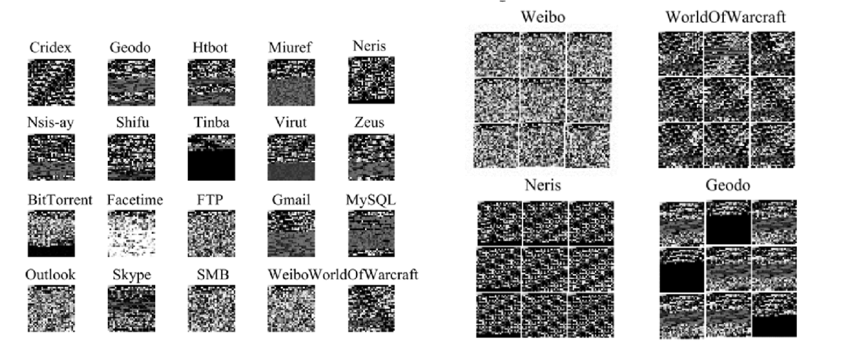
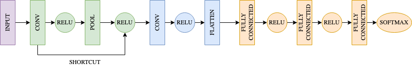

MAPLE
=======

MAPLE is a MAtrix-based PayLoad Encoder model which uses image-based
representation of packets in order to classify them through convolutional
neural network (CNN) analysis.

Feature Generation via Byte Encoding
~~~~~~~~~~~~~~~~~~~~~~~~~~~~~~~~~~~~~

MAPLE generates packet payload embeddings from the raw bytes of packet payloads.
A 28x28 matrix representation is formed by taking the first 784 bytes of the
input packet. These are converted from hexadecimal representation to a decimal
value, which is used as a pixel value in the final grayscale image representation.
If the packet is shorter than 784 bytes, padding is added as necessary.

   Example grayscale images generated from packets.

Deep Learning via CNN
~~~~~~~~~~~~~~~~~~~~~~

MAPLE uses a two-dimensional convolutional neural network model for image
comparison and classification. The 784 bytes are used as input features, with
the output layer containing the number of classes added during training mode.
The MAPLE model has a series of convolutional and pooling layers, followed by
a convolutional and flattening layer. Lastly, densely connected layers
with dropout between help reduce overfitting before softmax is used to provide
the final classification result.

   The MAPLE model used in Forager.

Storage and Optimization
~~~~~~~~~~~~~~~~~~~~~~~~~

The trained model is stored in JSON format along with its weights in an H5 file.
The JSON can be found under ``cache/maple/maple.json``, and the weights
can be found in the same folder under ``cache/maple/maple.h5``. ``cache/maple/labels.txt``
contains the labels which are associated with the weights in the training model.
It is important that the same labels which were used to train the model are used
in testing and that these labels are in the same order.

Installation
~~~~~~~~~~~~~

MAPLE is included as a supported module inside Forager.

Usage
~~~~~~

MAPLE must be pre-trained with data and labels before being used for classification.
PCAP/PCAPNG data may be provided to :ref:`tapcap` and given a label during the
training steps. You may add as many labels and input files as you would like to
the training model.

**Training Mode**:

.. code-block::

  Forager: A Network Training Classification Toolkit.
          Please choose a task:

     tabularize packet data (TaPCAP)
     generate regular expression signatures (RExACtor)
  => configure and train models (ALPINE, PALM, MAPLE, DATE)
     classify packets (ALPINE, PALM, MAPLE, DATE)
     clear current cache

In the main Forager menu, select "configure and train models" from the options.
Note that if you choose to proceed, the stored model and labels in the cache
directory will be overwritten. To save these models, copy them elsewhere before
proceeding to train new ones. Next, select MAPLE as a training model. Note here
that you may choose to train multiple models sequentially to save manual entry
and effort.

.. code-block::

  Forager: A Network Training Classification Toolkit.
  Please choose one or more models to train (press SPACE to mark, ENTER to continue):

     ( ) ALPINE
     ( ) PALM
  => (X) MAPLE
     ( ) DATE

Following selection, you will be asked to provide input files and a label for
each file. Labels may be re-used for multiple files. Note that labels must be
exact in order to match (i.e. case-sensitive, spelled identically). You will be
prompted for more files until you reply 'n'.

.. code-block::

  Forager: A Network Training Classification Toolkit
  Entering training mode...
  WARNING: editing a model's configuration will override its current cache and settings. Continue (y/n)? y
  CSV file input path? /Users/mkapoor1/Desktop/pop.csv
  Label? POP3
  Add another file (y/n)?

Once input files are provided, training will commence for the configured number
of epochs (default is 20). During training, loss, accuracy, precision, and recall
metrics will be printed to standard output. Once the training is complete,
the log will print the model description. The neural network model will be saved
to ``cache/maple/maple.json``, and the weights to ``cache/maple/maple.h5``. The
provided labels will be stored in ``cache/maple/labels.txt``.

**Testing Mode**:

.. code-block::

  Forager: A Network Training Classification Toolkit.
  Please choose a task:

     tabularize packet data (TaPCAP)
     generate regular expression signatures (RExACtor)
     configure and train models (ALPINE, PALM, MAPLE, DATE)
  => classify packets (ALPINE, PALM, MAPLE, DATE)
     clear current cache

In the main Forager menu, select "classify packets" from the options. You will
then be prompted to select the model(s) for training. The saved weights and
data structures from the previous training session will be loaded from the cache.
If no model is found, an error message will be shown.

.. code-block::

  Forager: A Network Training Classification Toolkit.
  Please choose one or more models to test (press SPACE to mark, ENTER to continue):

     ( ) ALPINE
     ( ) PALM
  => (X) MAPLE
     ( ) DATE

Next, you will need to provide an input file path for the test data.

.. code-block::

  Forager: A Network Training Classification Toolkit
  Entering testing mode...
  CSV file input path? /Users/mkapoor1/Desktop/pop.csv
  testing MAPLE

After classification is complete, results will be written to a file under
"cache/results/<input file name>_results.txt".

**Publication:**

Kapoor, M., Quance, J., Napolitano, M., Krishnan, S., Moyer, T.
`Detecting VoIP Data Streams: Approaches Using Hidden Representation Learning.
<https://thomasmoyer.org/pubs/kmq+2023.pdf>`_
In proceedings of 35th Annual Conference on Innovative Applications
of Artificial Intelligence (IAAI-23). 7-14 February 2023.
